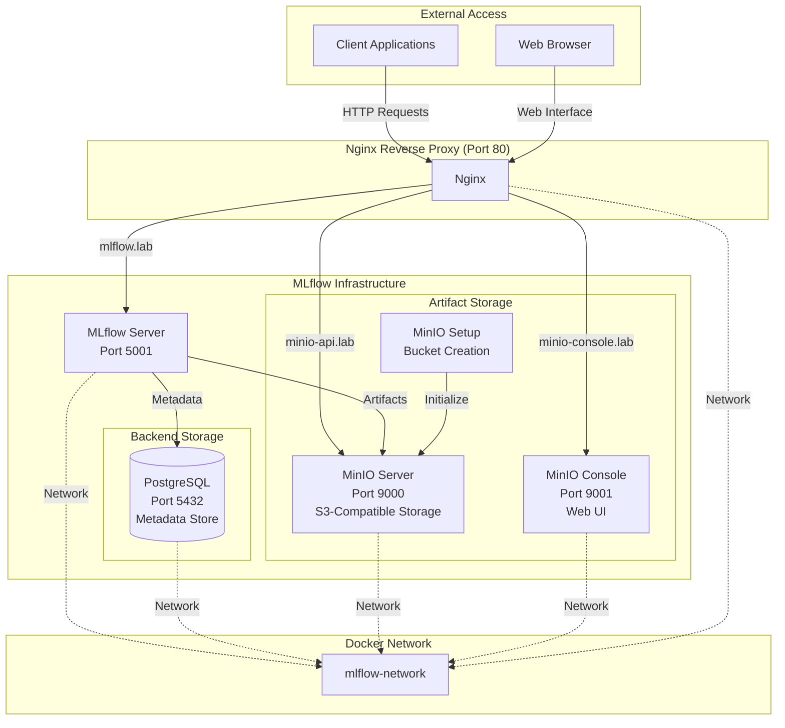

# MLflow Server Setup with Docker

A complete MLflow tracking server setup using Docker Compose with PostgreSQL backend, MinIO S3-compatible storage, and Nginx reverse proxy.

## Architecture



## Components

- **MLflow Server**: Experiment tracking server with web UI
- **PostgreSQL**: Backend database for MLflow metadata
- **MinIO**: S3-compatible object storage for artifacts
- **Nginx**: Reverse proxy with domain-based routing
- **Docker Network**: Isolated network for service communication

## Prerequisites

- Docker and Docker Compose
- Environment variables configured (see Configuration section)

## Configuration

Create a `.env` file in the project root with the following variables:

```env
# PostgreSQL Configuration
POSTGRES_USER=mlflow
POSTGRES_PASSWORD=your_postgres_password
POSTGRES_DB=mlflow

# MinIO Configuration
MINIO_ACCESS_KEY=minioadmin
MINIO_SECRET_ACCESS_KEY=your_minio_password

# MLflow Configuration
MLFLOW_S3_ENDPOINT=http://minio:9000
```

## Quick Start

1. **Clone and navigate to the project directory**
2. **Create environment file**:
   ```bash
   cp .env.example .env  # Edit with your values
   ```

3. **Start the services**:
   ```bash
   docker-compose up -d
   ```

4. **Verify deployment**:
   ```bash
   docker-compose ps
   ```

## Service Access

### Domain-based Access (Recommended)
Add these entries to your `/etc/hosts` file:
```
127.0.0.1 mlflow.lab
127.0.0.1 minio-console.lab
127.0.0.1 minio-api.lab
```

Then access:
- **MLflow UI**: http://mlflow.lab
- **MinIO Console**: http://minio-console.lab
- **MinIO API**: http://minio-api.lab

### Direct Port Access
- **MLflow Server**: http://localhost:5001
- **MinIO Console**: http://localhost:9001
- **MinIO API**: http://localhost:9000
- **PostgreSQL**: localhost:5432

## Usage

### Python Client Example

```python
import mlflow
import os

# Set MLflow tracking URI
mlflow.set_tracking_uri("http://mlflow.lab")  # or http://localhost:5001

# Configure S3 credentials for artifact storage
os.environ['AWS_ACCESS_KEY_ID'] = 'your_minio_access_key'
os.environ['AWS_SECRET_ACCESS_KEY'] = 'your_minio_secret_key'
os.environ['MLFLOW_S3_ENDPOINT_URL'] = 'http://minio-api.lab'  # or http://localhost:9000

# Start experiment
with mlflow.start_run():
    mlflow.log_param("param1", 5)
    mlflow.log_metric("metric1", 0.89)
    mlflow.log_artifact("model.pkl")
```


## Health Checks

All services include health checks:
- **PostgreSQL**: Database connection test
- **MinIO**: HTTP health endpoint
- **MLflow**: HTTP health endpoint

## Data Persistence

Data is persisted using Docker volumes:
- `postgres_data`: PostgreSQL database files
- `minio_data`: MinIO object storage files

## Troubleshooting

1. **Services not starting**: Check logs with `docker-compose logs <service_name>`
2. **Connection refused**: Ensure all services are healthy with `docker-compose ps`
3. **Artifact upload fails**: Verify MinIO credentials and S3 endpoint configuration
4. **Database connection errors**: Check PostgreSQL health and connection string

## Management Commands

```bash
# View service status
docker-compose ps

# View logs
docker-compose logs -f mlflow

# Restart services
docker-compose restart

# Stop all services
docker-compose down

# Stop and remove volumes (�  destroys data)
docker-compose down -v
```

## Security Notes

- Default MinIO credentials should be changed in production
- Consider using Docker secrets for sensitive data
- Nginx configuration can be extended with SSL/TLS certificates
- Network isolation is provided by the `mlflow-network` bridge

## Dependencies

- **MLflow**: 3.1.4
- **PostgreSQL**: 13
- **MinIO**: Latest
- **Nginx**: Alpine
- **Python**: 3.11